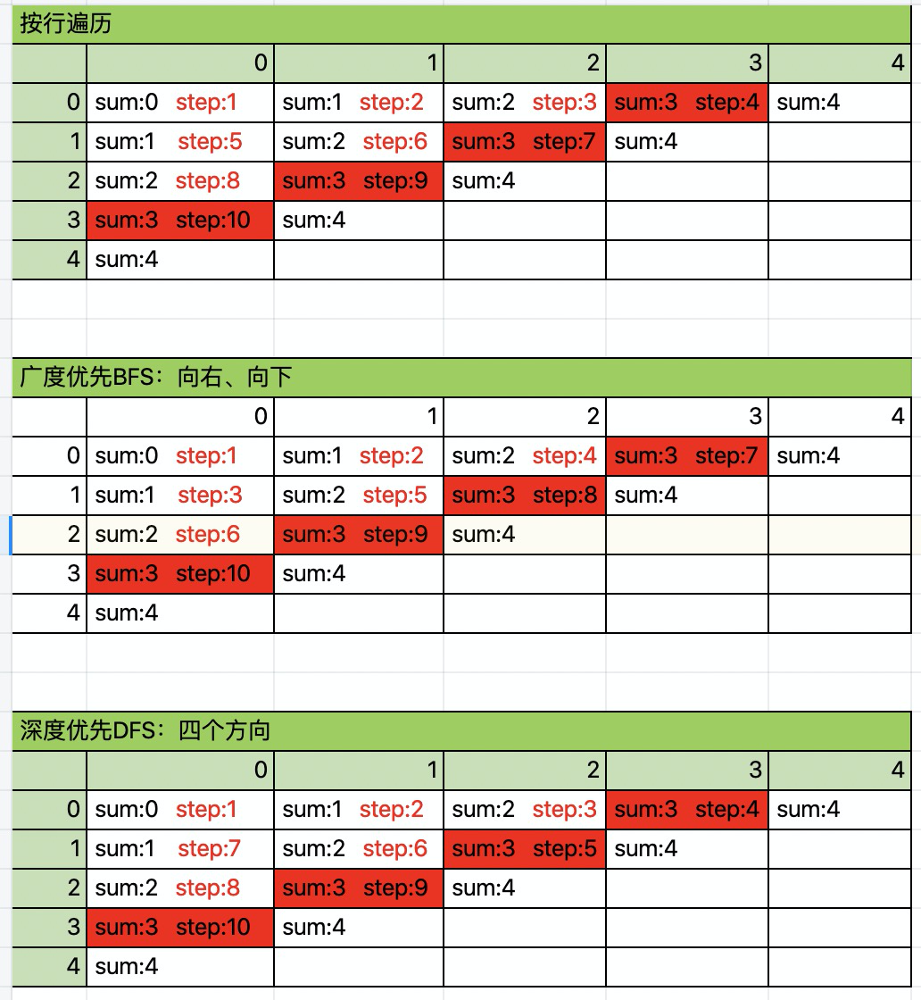

### 题目：剑指 Offer 13. 机器人的运动范围（中等）

地上有一个m行n列的方格，从坐标 [0,0] 到坐标 [m-1,n-1] 。一个机器人从坐标 [0, 0] 的格子开始移动，它每次可以向左、右、上、下移动一格（不能移动到方格外），也不能进入行坐标和列坐标的数位之和大于k的格子。例如，当k为18时，机器人能够进入方格 [35, 37] ，因为3+5+3+7=18。但它不能进入方格 [35, 38]，因为3+5+3+8=19。请问该机器人能够到达多少个格子？

示例 1：
```
输入：m = 2, n = 3, k = 1
输出：3
```

示例 2：
```
输入：m = 3, n = 1, k = 0
输出：1
```

提示：

- `1 <= n,m <= 100`
- `0 <= k <= 20`

来源：力扣（LeetCode）
链接：https://leetcode-cn.com/problems/ji-qi-ren-de-yun-dong-fan-wei-lcof

### 解题

数字的数位之和，利用取余拿到数字的最后一位的值，再把数字变小一位

```js
function bitSum(n) {
  let sum = 0
  
  while (n) {
    sum += (n % 10)
    n = Math.floor(n / 10)
  }

  return sum
}
```

解法1：暴力遍历法：一行一行的遍历，每一行再从0开始往后遍历
```js
function movingCount(m, n, k) {
  let res = 0
  for (let i = 0; i < m; i++) {
    for (let j = 0; j < n; j++) {
      if (bitSum(i) + bitSum(j) > k) {
        continue
      }
      res++
    }
    if (bitSum(i) > k) {
      continue
    }
  }

  return res
}
```

解法2: 广度优先遍历BFS（推荐）：依赖队列，先进先出。先放一个，再放和它相关的，放完相关的，出一个。一层一层的。直至队列空结束。

和普通 BFS 相比，有2点不同：
1. 需要调用 bitSum 来检查数位之和
2. 因为从左上角开始遍历，因此只需要遍历 右 和 下 这两个方向
```js
function movingCount (m, n, k) {
  let res = 0
  const directions = [
    [1, 0], // 向右
    [0, 1] // 向下
  ]
  const queue = [[0, 0]]
  // 标记 x,y 是否访问过
  const visited = {
    '0-0': true
  }

  while (queue.length) {
    const [x, y] = queue.shift()
    if (bitSum(x) + bitSum(y) > k) {
      continue
    }
    ++res

    for (const direction of directions) {
      const newx = direction[0] + x
      const newy = direction[1] + y
  
      if (!visited[`${newx}-${newy}`] && newx >= 0 && newy >= 0 && newx < m && newy < n) {
        queue.push([newx, newy])
        visited[`${newx}-${newy}`] = true
      }
    }
  }

  return res
}
```

解法3：深度优先遍历DFS：依赖递归，一条路到结束，再返回上一步继续。

DFS 不如 BFS，除了递归外，还要尝试 4 个方向（BFS 只要 2 个）

```js
function movingCount (m, n, k) {
  let res = 0
  const directions = [
    [-1, 0], // 向左
    [1, 0], // 向右
    [0, -1], // 向上
    [0, 1] // 向下
  ]
  const visited = {}
  dfs(0, 0)

  return res

  function dfs(x, y) {
    visited[`${x}-${y}`] = true
    if (bitSum(x) + bitSum(y) > k) {
      return
    }
    ++res

    for (const direction of directions) {
      const newx = direction[0] + x
      const newy = direction[1] + y

      if (!visited[`${newx}-${newy}`] && newx >= 0 && newy >= 0 && newx < m && newy < n) {
        dfs(newx, newy)
      }
    }
  }
}
```

验证：

```js
console.time('time')

console.log(movingCount(2, 3, 1)) // m:2, n:3, k:1 -> 3

console.log(movingCount(3, 1, 0)) // 1

console.log(movingCount(5, 5, 2)) // 6

console.timeEnd('time')
```

图解：以 `m=5`, `n=5`, `k=2`为例：

